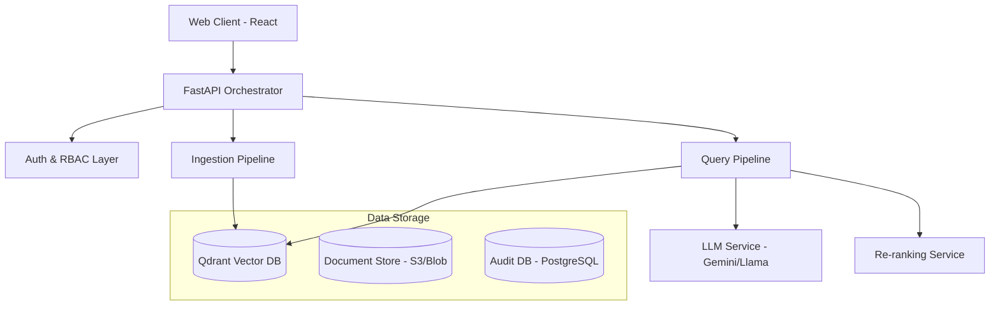
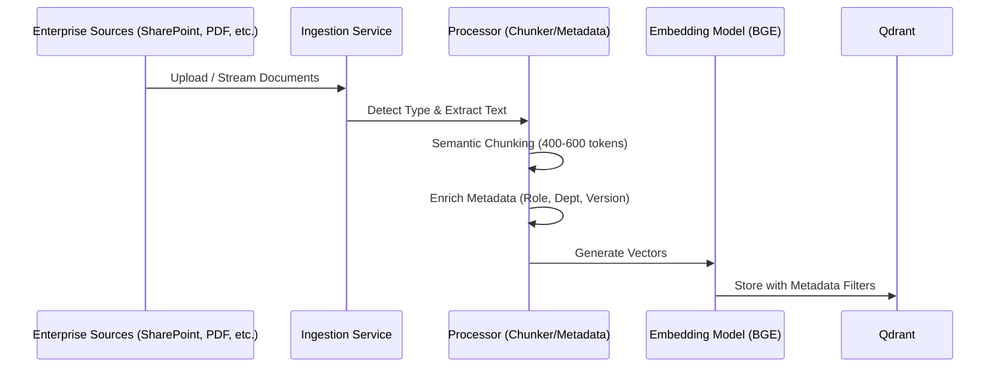
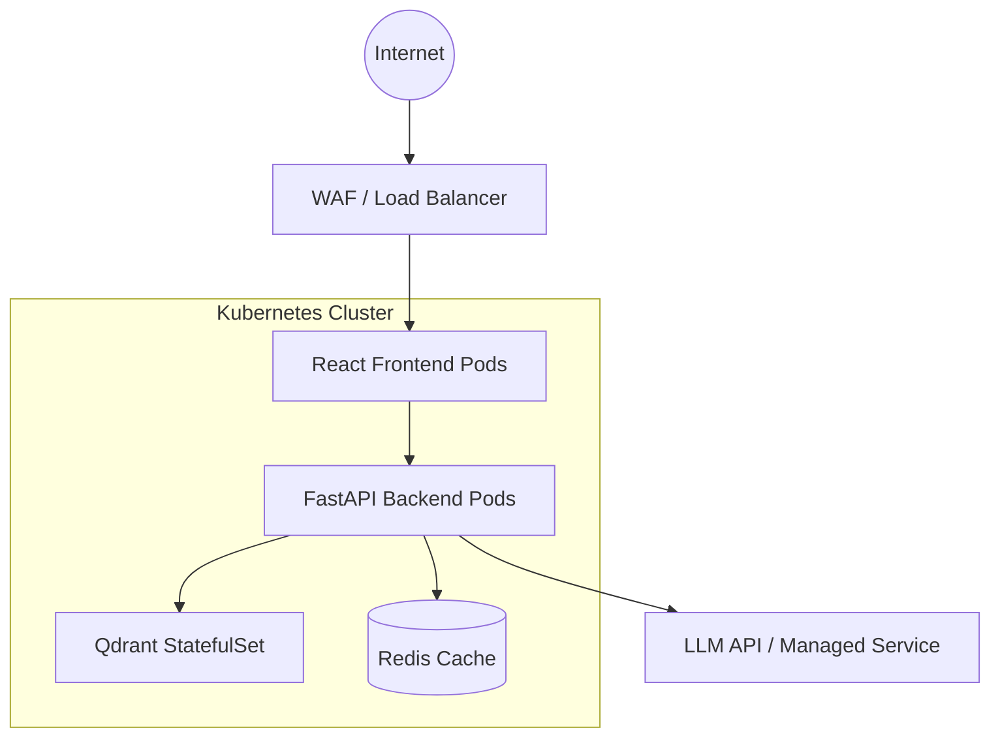

# BankAssist AI: System Architecture

## 1. Overview
BankAssist AI is a production-grade enterprise RAG system designed to consolidate banking knowledge and provide secure, grounded answers to internal and external stakeholders.

## 2. Logical Architecture

## 3. Data Pipeline Architecture (Ingestion)

## 4. Query Processing Pipeline

```mermaid
flowchart LR
    UserQuery[User Query] --> Embed[Query Embedding]
    Embed --> HybridSearch[Hybrid Search: Vector + BM25]
    HybridSearch --> RBACFilter[Apply Metadata Filters]
    RBACFilter --> RetTop20[Top 20 Chunks]
    RetTop20 --> Rerank[Cross-Encoder Re-ranker]
    Rerank --> Top5[Top 5 Relevant Chunks]
    Top5 --> LLM[LLM Generation w/ Grounding Prompt]
    LLM --> Validation[Response Validation]
    Validation --> FinalRes[Final Response with Citations]
```

## 5. Security Architecture
- **RBAC Enforcement**: Metadata-level filtering in Qdrant ensures zero-leakage between roles.
- **Data Protection**: Encryption at rest (AES-256) and in transit (TLS 1.3).
- **Audit Traceability**: Every query is logged with user ID, timestamp, retrieved chunks, and generated response.
- **PII Redaction**: Pre-processing layer to mask sensitive customer data.

## 6. Technology Stack
- **Frontend**: React.js, Tailwind CSS (for premium aesthetics), Shadcn UI.
- **Backend**: FastAPI (Python), Pydantic.
- **Orchestration**: LangChain / LlamaIndex.
- **Vector Database**: Qdrant.
- **Models**:
    - Embedding: `BAAI/bge-small-en-v1.5`
    - Re-ranking: `BAAI/bge-reranker-base`
    - LLM: `Gemini 1.5 Flash` or `Llama 3`.
- **Infrastructure**: Docker, Kubernetes.

## 7. Deployment View

